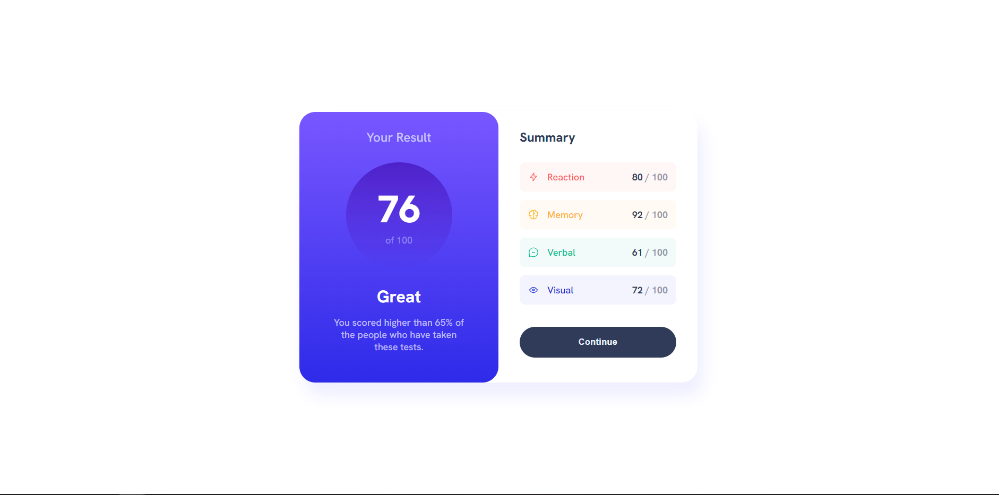

# Frontend Mentor - Results summary component

## Welcome! 👋

### Links

- [Solution Code Here](https://github.com/MaximilianoDanielGarcia/FrontendMentor/tree/master/results-summary-component-main)
- [Live Site Here](https://frontend-mentor-n29z.vercel.app/)

### Built with

- Semantic HTML5 markup
- CSS custom properties
- Flexbox
